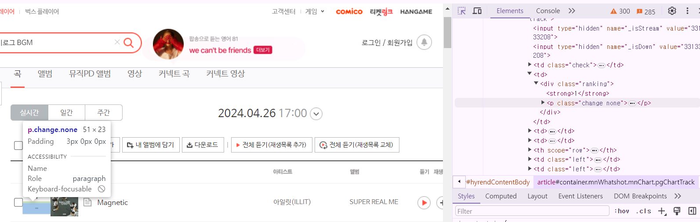

## CSS 

#### 문단(paragtaph)관련 스타일

<hr />

CSS의 다양한 속성 중 문단 관련 스타일에 대해 알아볼 예정입니다.
문단 관련스타일은 그 적용 결과가 글자 개체보다는 문단별로 보았을 때 더 두드러지게 나타나는 속성들로 구성되어 있습니다.

>  ✅ text-align

블록 요소에만 적용되는 속성으로서, 문단을 블록의 왼쪽, 가운데, 오른쪽, 양쪽 등으로 정렬시킵니다.

- left : 왼쪽 정렬
- center : 중앙 정렬
- right : 오른쪽 정렬
- justify : 양쪽 정렬

> ✅ vertical-align

이미지나 폼 요소를 위, 가운데, 아래로 세로 정렬시켜 주는 속성으로 img, input, select, label, 테이블의 th, td등에 사용합니다.

- top : 위쪽 정렬
- middle : 세로 중앙 정렬
- bottom : 아래쪽 정렬

💘 vertical-align은 나란히 배치된 이미지와 폼 요소 등 인라인 요소들 사이의 세로정렬에도 유용합니다.

> ✅ text-indent

문단의 첫 머리를 들여쓰기 해주는 속성으로서, "블록 요소"에만 적용됩니다.

> ✅ word-wrap

영문을 띄어쓰기 없이 길게 입력하면 width 값을 주어도 박스 밖으로 튀어 나오게 됩니다.
word-wrap 속성을 이용하여 이것을 가로 폭에 맞추어 적당히 잘라 다음 줄로 내려오도록 할 수 있는데, 다음과 같이 표현합니다.

````css
word-wrap: break-word;

예시 : 
<!DOCTYPE html>
<html lang="ko">
<head>
<meta charset="UTF-8">
<title>word-wrap 예시</title>
<style>
  .wrap-text {
    width: 200px; /* 컨테이너의 너비 설정 */
    border: 1px solid #000; /* 테두리 설정 */
    padding: 10px; /* 안쪽 여백 설정 */
    word-wrap: break-word; /* 긴 단어가 경계를 넘어갈 때 줄바꿈 설정 */
  }
</style>
</head>
<body>

<div class="wrap-text">
  이것은word-wrap속성을테스트하기위한매우긴단어입니다.이속성은단어가컨테이너의경계를넘어갈때줄바꿈을하도록합니다.
</div>

</body>
</html>
````


✅check-point
띄어쓰기 없는 긴 단어처럼 표현했는데도 word-wrap을 적용하여 줄바꿈 설정을 할 수 있네요!

>✅ word-break

줄 끝에서 어떻게 단어를 끊어주어야 하는지에 관하여 이 속성을 사용할 수 있습니다.

- normal : 기본값
- break-all : 글자가 넘치면 줄바꿈
- keep-all: 단어를 끊어 줄바꿈하지 않음

단어가 떨어지지 않는 세 번째가 가장 좋지만 상자 밖으로 긴 단어가 튀어나갈 수도 있습니다.
이럴때 앞서 배웠던 word-wrap:break-word;를 이용합니다.

````css
.breaking3 { word-break: keep-all; word-wrap: break-word; }
````
그러면 단어도 유지되고 긴 단어(ex.이메일 주소)도 밖으로 나가지 않습니다.


> ✅ white-space

마크업한 문자들 사이의 공백을 처리하여 내보내는 속성입니다.

- normal : 연속 공백들과 줄바꿈이 하나의 공백으로 처리 👉🏼 길면 줄바꿈 일어남

- nowrap : 연속 공백들과 줄바꿈이 하나의 공백으로 처리 👉🏼 길어도 줄바꿈 없이 박스 밖으로 나감

- pre : 연속 공백들과 줄바꿈이 소스 그대로 표현됨

- pre-wrap : 연속 공백들과 줄바꿈이 소스 그대로 표현되나, 길면 줄바꿈 일어남

- pre-line : 연속 공백들이 하나의 공백으로 처리, 줄바꿈은 소스 그대로 표현되나, 길면 줄바꿈 일어남

> ✅ text-overflow

긴 텍스트에 말줄임 기호를 사용하고자 할 때, 다음과 같이 표현합니다.

````css
text-overflow: ellipsis;
````

> ✅ display

요소의 성격을 바꿔주는 속성으로서, display가 어떻게 설정되어있는지에 따라 그 후 사용할 수 있는 속성이 달라집니다.

▶ 블록, 인라인 요소 변경
html요소들은 block 또는 inline의 기본값들을 가지고 있는데, 그 기본값을 변경해 줄 수 있습니다.

- block : inline 요소의 성격을 block으로 변경함 👉🏼 줄바꿈이 일어남

- inline : block요소의 성격을 inline으로 변경함 👉🏼 줄바꿈이 일어나지 않음

- inline-block : inline 요소의 성격을 inline-block으로 변경함 👉🏼 줄바꿈은 일어나지 않으나 block 요소만 사용할 수 있는 text-aling 등의 속성을 사용할 수 있게 됨

- none : 요소를 보이지 않게 숨기고 흔적도 숨김

HTML5의 요소를 인식하지 못하는 구형 브라우저를 대비하여 CSS 앞단에 다음과 같이 블록을 선언할 때 필요합니다.

````css
article, aside, details, figcaption, figure, footer, header, hgroup, menu, nav, section {
    display: block;
}
````

> ✅ visibility
 
요소를 숨기거나 보이도록 해주는 속성입니다.

- visible : 요소를 보이도록 함
- hidden : 요소를 숨김(내용이 있던 자리는 남아있음)

✔ check-point !
display: none;으로 숨겨진 요소들은 흔적도 없지만, visibility: hidden;으로 숨겨진 요소들의 자리는 빈칸으로 남아있습니다.


> ✅ overflow

요소 안의 내용이 요소의 크기보다 많을 경우 넘치는 부분을 처리하는 속성입니다.

- hidden : 넘치는 콘텐츠를 숨김
- auto : 콘텐츠가 넘칠 경우에만 스크롤바를 생성함
- scroll : 콘텐츠가 넘치치 않아도 스크롤바를 생성함
scroll-x, scroll-y : 한 방향으로만 스크롤바 생성 가능

- visible : 넘치는 콘텐츠가 그대로 노출됨

> ✅ opacity

요소에 투명도를 부여할 수 있는 속성으로 다음과 같이 표현합니다.

````css
opacity: 0.5;
````

속성 값은 투명에서 불투명까지 0~1로 표현하므로 0.5는 반투명에 해당됩니다.


